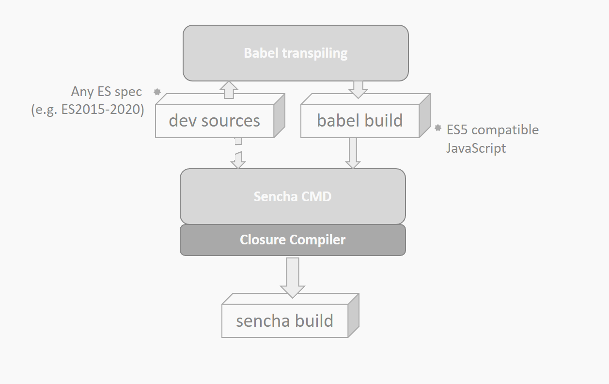

# delorean

ECMAScript transpilation layer for Sencha CMD / Ext JS.

Allows for using modern ECMAScript in your source code. Will transpile to ES versions Sencha CMD and its baked in 
Closure Compiler understands.

Makes it possible to use 
 - the nullish coalescing operator
 - the optional chaining operator 
 - destructuring assignment syntax 

without breaking builds created with Sencha CMD:

````javascript
const foo = null ?? "default string";

const fn = ([x, y, z]) => ({x, y, z});

const adventurer = {
    name: "Alice",
    cat: {
        name: "Dinah"
    }
};

const dogName = adventurer.dog?.name;
````


## Installation

Install **@coon-js/delorean** with

```bash
$ npm i --save-dev @coon-js/delorean
```

## How it works
**@coon-js/delorean** is an npm tool that provides an additional transpiling layer on top of Sencha CMD with the help of 
[**Babel**](httpy://babel.dev).



For making this work, **delorean** alters the project file of the package or application and redirects source-roots to the
files that were processed and transpiled by Babel. This allows for using any JavaScript language feature in the project 
code (even class syntax is now possible): With the default configuration of **delorean**, it will end up as ES5 code.

There is a [detailed blog post](https://medium.com/@thorstensuckow/sencha-ext-js-beyond-es5-a0382916b7a6) available 
that explains the motivation, the purpose and the internal functionality of this tool for further reference.


## Usage

```bash
$ npx delorean 
```

will show the help-screen of **delorean**.

Run

```bash
$ npx delorean -p
```

This will add a `.babelrc` and a `.deloreanrc.json` to the root-directory of the package that is using
**@coon-js/delorean**.

Transpiled source files will be available in the `.deloreanbuild`-folder found in the project's root. Your
`app.json` / `package.json` will contain updated information regarding source folders (e.g. `classpath`, see [configuration](#configuration)),
which will now point to `.deloreanbuild:

```diff
  "classpath": [
-            "${package.dir}/src",
-            "${package.dir}/${toolkit.name}/src"
+            "${package.dir}/.deloreanbuild/src",
+            "${package.dir}/.deloreanbuild/${toolkit.name}/src"
         ],
         "overrides": [
-            "${package.dir}/overrides",
-            "${package.dir}/${toolkit.name}/overrides"
+            "${package.dir}/.deloreanbuild/overrides",
+            "${package.dir}/.deloreanbuild/${toolkit.name}/overrides"
         ],
```

Subsequent **Sencha CMD** build processes will consume the transpiled sources found in this directory.

```bash
$ npx delorean -r
```

will revert the changes made to the `app.json` / `package.json`:

```json
  "classpath": [
      "${package.dir}/src",
      "${package.dir}/${toolkit.name}/src"
  ],
  "overrides": [
      "${package.dir}/overrides",
      "${package.dir}/${toolkit.name}/overrides"
  ]
```

## Command Line Options

### `--prepare, -p`
Prepares the `.deloreanbuild` folder, adds transpiled sources to it and update the project file so that particular entries
point to **this** folder as the sources root (see [configuration](#configuration)).

### `--revert, -r`
Reverts the changes made to the configuration files.

### `--help, -h`
Show the **help** screen.

## Configuration
#### `.deloreanrc.json`
The configuration file required by **delorean**.
Contains options for setting JSON-keys available with Sencha's Ext JS `package.json` / `app.json` that should be used
for determining the JavaScript-source files for transpiling.

```json
{
    "map" : [
      "sencha.classpath",
      "sencha.overrides",
      "classpath",
      "overrides"
    ],
    "toolkits": [
      "modern", "classic"
    ],
    "build": [
      "desktop", "shared"
    ]
}
```

#### `map`
- Type: `Array`

Holds all the JSON-keys that should be considered when collecting source-directories for transpiling. Values containing
template-strings will be properly considered, such as

- `${package.dir}/src`
- `${toolkit.name}/src`
- `app/${build.id}/overrides`

#### `toolkits`
- Type: `Array`

Holds the values that should be used when evaluating strings containing templates, such as `${toolkit.name}/src`.
With `toolkits` set to `["modern", "classic"]`, the directories `modern/src` and `classic/src` will be considered
when collecting source files for transpiling.

#### `build`
- Type: `Array`

Holds the values that should be used when evaluating strings containing templates, such as `app/${build.id}/overrides`.
With `build` set to `["desktop", "shared"]`, the directories `app/desktop/overrides` and `app/shared/overrides` will be considered
when collecting source files for transpiling.

#### `.babelrc`
The configuration file required by **Babel**
The `.babelrc` is the configuration file for **Babel** and has default options known to
work with Sencha Ext JS projects >= 7.4. Adjust to your needs. See [the documentation](https://babeljs.io/)
for an exhaustive list of configuration options.


## CI/CD Integration
The two commands are easily integrated with CI/CD pipelines commonly used with Sencha Ext JS projects.
You can automate transpiling by configuring either the `build.xml` of a Sencha package or a Sencha app, or by adding additional scripts to the `package.json`.

### build.xml
This file is available with any package or app that is created with Sencha Ext JS. It provides a place for adding options and hooks for the Ant tool used with Sencha CMD and allows for configuring -before-build /-after-build targets (amongst others). You can make use of delorean by configuring the targets like so:

```xml
<target name="-before-build">
    <exec executable="cmd">
        <arg line="/c npx delorean -p"/>
    </exec>
</target>

<target name="-after-build">
    <exec executable="cmd">
        <arg line="/c npx delorean -r"/>
    </exec>
</target>
```
This will run `npx delorean -p` before Sencha CMD builds the project, and revert all project specific changes once the build completes by invoking `npx delorean -r`.

### package.json
If you already have a build script in your package.json that calls Sencha CMD, wrap the build command with calls to **delorean**. Here’s an example:

```json
{
  "scripts": [
    "build": "npx delorean -p && npm run senchabuild && npx delorean -r",
    "senchabuild": "npm run clean && cross-env webpack --env.profile=desktop --env.environment=production --env.treeshake=yes --env.cmdopts=--uses"
  ]
}
```
