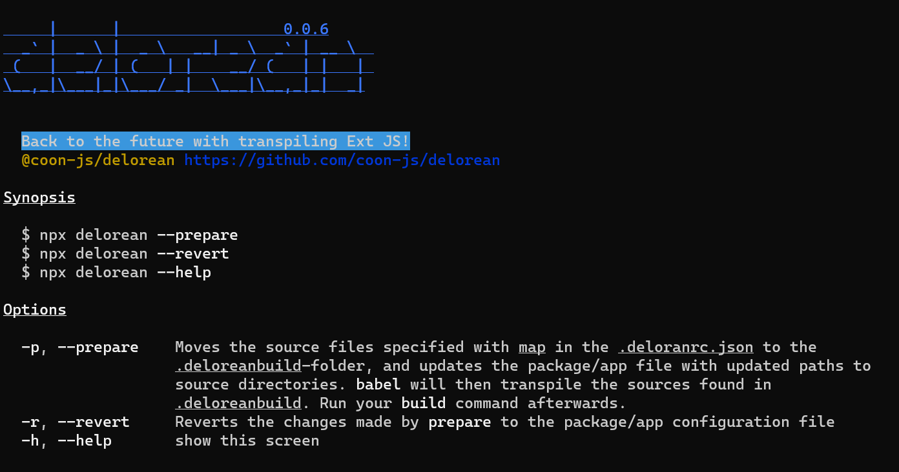

# `@coon-js/delorean`



Script for transpiling Sencha Ext JS to ES 5 .

Allows for using modern ECMA script during development and convert to an ES version the Closure compiler
of Sencha CMD understands.

## Installation

Install **@coon-js/delorean** with 

```bash
$ npm i --save-dev @coon-js/delorean
```

## How does it work
Anyone who needs to work with **Sencha CMD** as part of a build process of an Ext JS project might have
faced the problems that occur when modern JavaScript syntax is used, such as the
[Nullish coalescing operator](https://developer.mozilla.org/en-US/docs/Web/JavaScript/Reference/Operators/Nullish_coalescing)

```javascript
const foo = null ?? 'default string';
```

the spread syntax with function arguments

```javascript
const fn = ([x, y, z]) => ({x, y, z});
```
or the [Optional chaining operator](https://developer.mozilla.org/en-US/docs/Web/JavaScript/Reference/Operators/Optional_chaining):

```javascript
const adventurer = {
  name: 'Alice',
  cat: {
    name: 'Dinah'
  }
};

const dogName = adventurer.dog?.name;
```

Unfortunately, **Sencha CMD** uses an outdated Closure Compiler. Any of the above examples do not work 
with Sencha CMD 7.4, and I was told that manually configuration by the developers maintaining Sencha CMD
is required to allow for particular syntax support (source: [Sencha Discord Server](https://discord.gg/D7ypB45D)).

To allow for modern JavaScript development with Ext JS, we can add a transpiling layer to which we redirect
the development sources and feed the Closure Compiler with the Syntax it understands. 

To do so, **delorean** alters the project file to make sure it points to the sources that were processed by **Babel**.
**Sencha CMD** considers there project files during a standard build process and will use all the file
resources resolved with the help of the project configuration files.

To revert to the original project configuration file not pointing to the transpiled sources, a simple cli command
can be used. This makes integrating **delorean** in existing **ci** environments easy. As a bonus, developers
who have to forego the usage of `let` or similar because some outdated Browser does not support it can now
happily hack away!

However, we must consider the fact that **babel** adds some polyfills to the source code. I have not measured
growth of the transpiled code, but I consider this fact as neclegtable now that I can use the Syntax I'm used
to from more modern JavaScript frameworks.

## Usage


```bash
$ npx delorean 
```

will show the help-screen of **delorean**.

Run

```bash
$ npx delorean -p
```

This will add a `.babelrc` and a `.deloreanrc.json` into the root-directory of the package that is using
**@coon-js/delorean**.

Transpiled Source files will be available in the project's root `.deloreanbuild`-folder. Your
`app.json` / `package.json` will be updated with source-roots (e.g. `classpath`, see [configuration](#configuration))
pointing to `.deloreanbuild`.
Sencha CMD will in any subsequent build-process consume the transpiled sources from this folder.

```bash
$ npx delorean -r
```

will revert the changes made to `app.json` / `package.json` by **@coon-js/delorean**.

## Command Line Options

### `--prepare, -p`
Prepares the `.deloreanbuild` folder with transpiled sources and update the project file to point to
this folder as the sources root (as [configured](#configuration)).

### `--revert, -r`
Reverts the changes made to the project configuration files.

### `--help, -h`
Show the **help** screen.

## Configuration 
#### `.deloreanrc.json`
The configuration file required by **delorean**.
Contains options for setting JSON-keys available with Sencha's Ext JS `package.json` / `app.json` that should be used
for determining the JavaScript-source files that should get transpiled.

```json
{
    "map" : [
      "sencha.classpath",
      "sencha.overrides",
      "classpath",
      "overrides"
    ],
    "toolkits": [
      "modern", "classic"
    ],
    "build": [
      "desktop", "shared"
    ]
}
```

#### `map`
 - Type: `Array`
Holds all the JSON-keys that should be considered when collecting source-directories that should get transpiled.
Values containing template-strings will be properly considered, such as

 - `${package.dir}/src` 
 - `${toolkit.name}/src`
 - `app/${build.id}/overrides`

#### `toolkits`
- Type: `Array`
  Holds the values that should be used when evaluating values containing template-strings, such as `${toolkit.name}/src`.
With `toolkits` set to `["modern", "classic"]`, the directories `modern/src` and `classic/src` will be considered
when collecting source files for transpiling.

#### `build`
- Type: `Array`
  Holds the values that should be used when evaluating values containing template-strings, such as `app/${build.id}/overrides`.
  With `build` set to `["desktop", "shared"]`, the directories `app/desktop/overrides` and `app/shared/overrides` will be considered
  when collecting source files for transpiling.

#### `.babelrc`
The configuration file required by **babel**
The `.babelrc` is the configuration file for **babel** and has default options known to
work with Sencha Ext JS projects >= 7.6. Adjust to your needs. See [the documentation](https://babeljs.io/)
for an exhaustive list of configuration options.


## Automated transpiling
You can automate transpiling by configuring either the `build.xml` of your package or app, or by adding
scripts to your **npm** `package.json`.

### `build.xml`
Adjust the `-before-build` and `-after-build` targets in your `build.xml`, like so:
```xml
<target name="-before-build">
    <exec executable="cmd">
        <arg line="/c npx delorean -p"/>
    </exec>
</target>

<target name="-after-build">
    <exec executable="cmd">
        <arg line="/c npx delorean -r"/>
    </exec>
</target>
```

This will run `npx delorean -p` before **Sencha CMD** builds the project, and `npx delorean -r` when
building was finished.

### `package.json`
If you already have a build script that calls **Sencha CMD**, wrap the **build** command with **delorean**:Adjust the Next, you need to adjust the `-before-build` and `-after-build` targets, e.g.:


```json
{
  "scripts": [
    "build": "npx delorean -p && npm run senchabuild && npx delorean -r",
    "senchabuild": "npm run clean && cross-env webpack --env.profile=desktop --env.environment=production --env.treeshake=yes --env.cmdopts=--uses" ]
  ]
}
```

